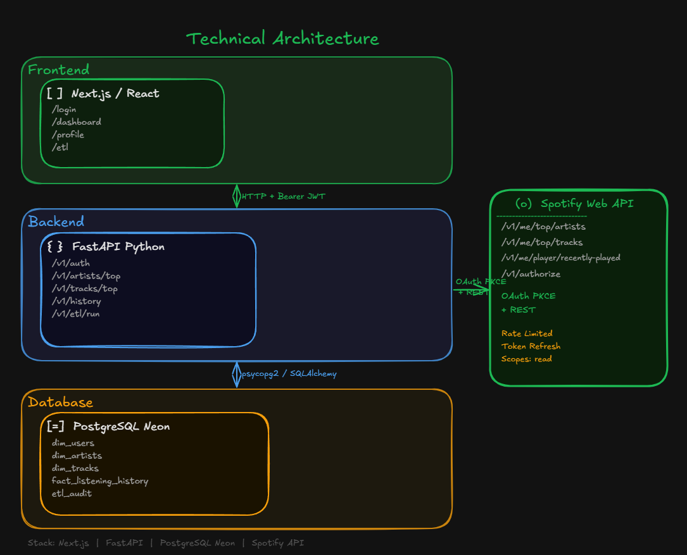
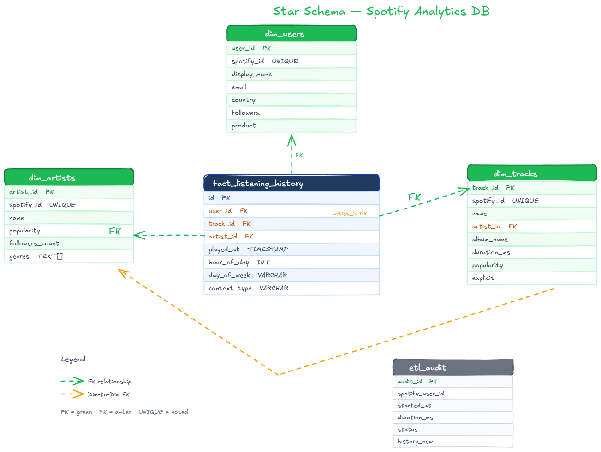
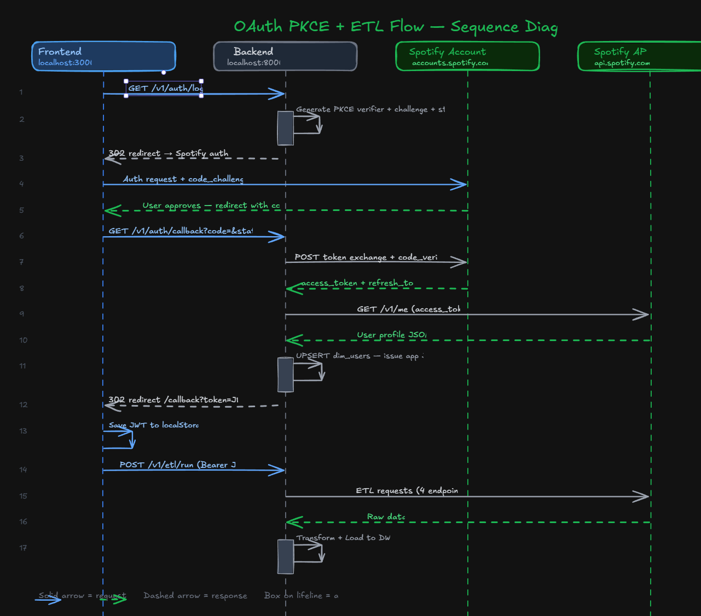

# Mi Spotify Wrapped — Personal Data Warehouse

Proyecto integrador de bases de datos: pipeline ETL completo que consume la Spotify Web API y construye un mini Data Warehouse personal en PostgreSQL. Cada estudiante usa su propia cuenta de Spotify como fuente de datos para el análisis exploratorio.

---

## 🏛️ Arquitectura general



---

## 🌌 Modelo dimensional (Galaxy Schema)



- El modelo sigue una arquitectura híbrida Constelación de Hechos (*Galaxy Schema*). `dim_tracks.artist_id` actúa como una FK entre dimensiones conformadas, añadiendo un elemento *snowflake* (copo de nieve) que optimiza las consultas analíticas y el mantenimiento del pipeline ETL sin sacrificar rendimiento.

---

## 🔄 Flujo OAuth PKCE + Orquestación ETL



---

## 💻 Stack Tecnológico Oficial

| Capa | Tecnología |
|---|---|
| **Base de Datos** | PostgreSQL 16 en Neon Cloud (Serverless) |
| **Backend** | Python 3.11+ con FastAPI |
| **ORM & Migraciones** | SQLAlchemy 2.0 + Alembic |
| **Frontend** | React 18 empaquetado con Vite |
| **Estilizado UI** | Vanilla CSS (CSS3 Puro con variables y módulos) |
| **Gráficos UI** | Recharts + Lucide React |
| **Autenticación** | Spotify OAuth 2.0 con flujo PKCE |
| **Ciencia de Datos (EDA)** | Jupyter Notebook + Pandas + Seaborn |
| **Documentación API** | OpenAPI (Swagger UI) autogenerado en `/docs` |

---

## 🚀 Guía Paso a Paso para Ejecutar el Proyecto Funcional

Sigue estas instrucciones para levantar todo el ecosistema (Backend, Frontend y Base de Datos) en tu máquina local de forma exitosa:

### ⚙️ 1. Configuración y Ejecución del Backend (FastAPI)

1. **Abre una terminal en la raíz del proyecto** y verifica que el entorno virtual esté activado:
   ```bash
   source .venv/bin/activate      # En Windows: .venv\Scripts\activate
   ```
2. **Instala las dependencias** (si no lo has hecho previamente):
   ```bash
   pip install -r requirements.txt
   ```
3. **Verifica tus variables de entorno:** Asegúrate de tener el archivo `.env` en la raíz con tus credenciales de Spotify y la `DATABASE_URL` de Neon.
4. **Ejecuta las migraciones de base de datos** para verificar que las tablas existan en Neon:
   ```bash
   alembic upgrade head
   ```
5. **Inicia el servidor web FastAPI** (asegurando que Python reconozca el directorio raíz):
   ```bash
   PYTHONPATH=. uvicorn app.main:app --reload --port 8000
   ```
6. **Verifica la API:** Abre tu navegador y entra a `http://127.0.0.1:8000/docs` para ver la interfaz interactiva de Swagger UI.

---

### 💻 2. Configuración y Ejecución del Frontend (React + Vite)

1. **Abre una segunda terminal** y navega a la carpeta del frontend:
   ```bash
   cd frontend
   ```
2. **Instala los paquetes de Node:**
   ```bash
   npm install
   ```
3. **Inicia el servidor de desarrollo Vite:**
   ```bash
   npm run dev
   ```
4. **Abre la aplicación:** Entra desde tu navegador a `http://localhost:3000`.
5. **Flujo de Uso:** Haz clic en **"Iniciar Sesión con Spotify"**. Al completar la autorización, el backend disparará automáticamente el pipeline ETL en segundo plano para sincronizar tus canciones recientes con la base de datos de Neon.

---

### 📊 3. Ejecución del Análisis Exploratorio de Datos (EDA)

El análisis exploratorio se encuentra en la carpeta `notebooks/`. Para visualizar o regenerar las gráficas con tus datos más recientes:

1. **Desde VSCode:** Abre el archivo `notebooks/eda_spotify_william_santiago.ipynb`.
2. Haz clic en el botón **`Reiniciar y ejecutar todo`** (*Restart & Run All*) en la barra superior del notebook.
3. El notebook se conectará a Neon de forma segura usando las variables del `.env`, descargará tus tablas frescas y generará de inmediato las 4 visualizaciones obligatorias (Top Artistas, Horas de escucha, Popularidad Mainstream y Distribución de Géneros).

---

## 📂 Estructura del Repositorio

```
spotify-dwh-project/
├── app/                            ← Código fuente del Backend FastAPI
│   ├── core/                       ← Clientes de Spotify, seguridad y config
│   ├── db/                         ← Modelos SQLAlchemy y sesión
│   └── v1/                         ← Routers de la API y servicios ETL/Auth
├── alembic/                        ← Migraciones de base de datos
├── frontend/                       ← Proyecto React + Vite (Dashboard UI)
├── notebooks/                      ← Análisis Exploratorio de Datos (EDA)
├── docs/                           ← Documentación técnica y prompts de cada fase
├── .env                            ← Variables de entorno y credenciales (No versionado)
└── README.md                       ← Guía principal del proyecto
```

---

## 👥 Autores y Colaboradores

- **William Leal**
- **Santiago Capacho**

*Universidad de Pamplona · Bases de Datos II · 2026-I*  
*Profesor: Juan Alejandro Carrillo Jaimes*
