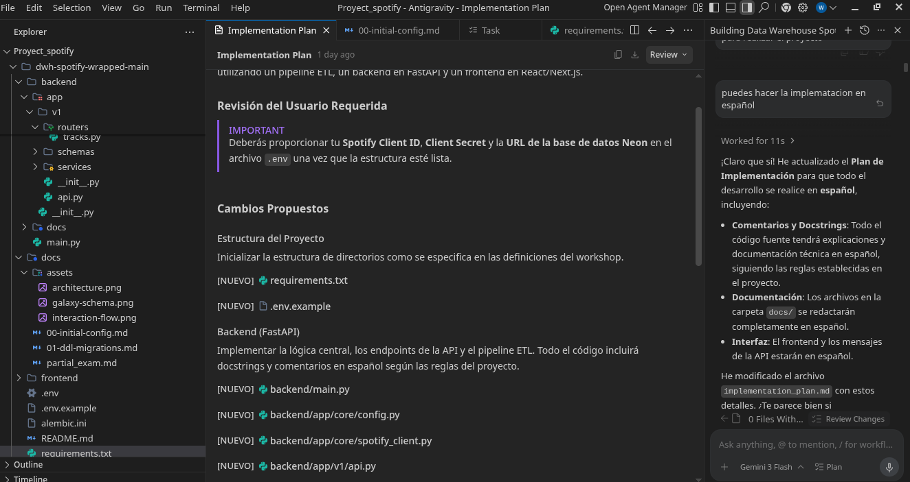

# 00. Configuración Inicial del Proyecto

## Qué se configuró / implementó
1. **Estructura de Directorios**: Se creó la jerarquía de carpetas para el backend siguiendo el estándar FastAPI (`app/core`, `app/v1`, `app/db`).
2. **Entorno Virtual**: Se inicializó un entorno `.venv` y se instalaron las dependencias base en `requirements.txt`.
3. **Variables de Env**: Se creó el archivo `.env.example` con las claves necesarias para Spotify y Neon.
4. **Modelos de Datos**: Se definieron los modelos de SQLAlchemy para el esquema `dwh` (dimensiones y tablas de hechos).
5. **Alembic**: Se inicializó y configuró el sistema de migraciones para manejar el esquema de base de datos.

## Screenshots

## Prompt utilizado
"He proporcionado el archivo zip del proyecto y las definiciones del workshop. Por favor, inicializa la estructura de carpetas, crea el archivo requirements.txt, .env.example y define los modelos de base de datos en SQLAlchemy siguiendo estrictamente las reglas del workshop y en idioma español."

## Técnica de prompting aplicada
**Role Prompting**: Se le asignó a la IA el rol de un asistente experto en ingeniería de datos y FastAPI para asegurar que la estructura siguiera las mejores prácticas y los requisitos del profesor.
