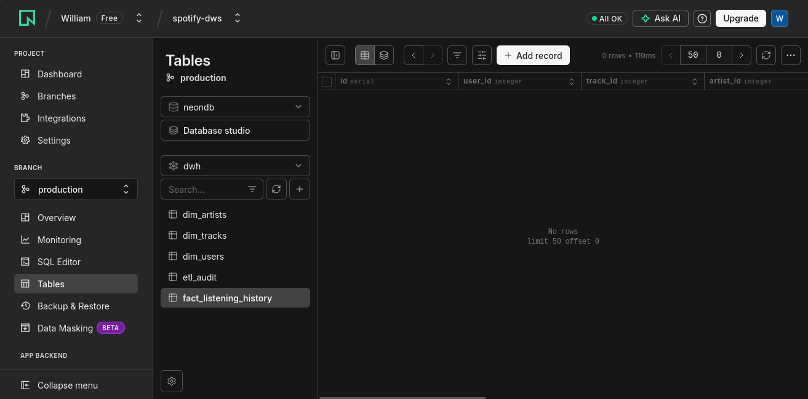

# 01. DDL y Migraciones con Alembic

## Qué se configuró / implementó
Se configuró Alembic para manejar las versiones de la base de datos de forma automática. Se incluyó soporte para el esquema `dwh` y se verificó que la metadata de SQLAlchemy (`Base.metadata`) sea reconocida por el motor de migraciones para generar scripts DDL automáticos.

## Screenshots
1. **Generación y Aplicación de migración**: 

2. **Tablas en Neon (Schema dwh)**: 

## Prompt utilizado
"Configura Alembic en el proyecto para que lea la URL de la base de datos desde el archivo .env y reconozca los modelos de SQLAlchemy que creamos en backend/app/db/models.py. Asegúrate de incluir soporte para el esquema 'dwh' y que las migraciones sean autogeneradas."

## Técnica de prompting aplicada
**Chain of Thought**: Se le pidió a la IA que configurara paso a paso la integración entre los modelos y el sistema de migraciones para asegurar que Alembic detectara correctamente los cambios en el esquema 'dwh'.
